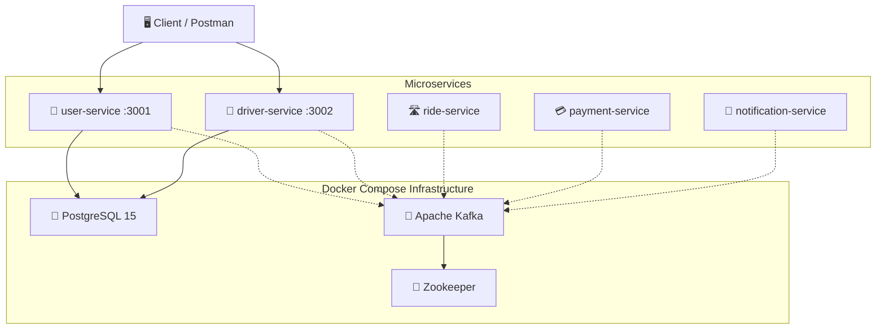

# FluxRide — Project Summary

## What is FluxRide?

FluxRide is an **event-driven microservices ride-sharing backend** (like Uber/Ola) built with **TypeScript, Express, PostgreSQL, Prisma, and Apache Kafka**. The entire infrastructure is orchestrated using **Docker Compose**.

The core idea: instead of one giant monolith, the app is split into **5 independent services** that communicate asynchronously via Kafka events. Each service owns its own database schema and can be developed, deployed, and scaled independently.

---

## Architecture Overview



---

## Tech Stack

| Layer | Technology |
|---|---|
| **Language** | TypeScript (strict mode) |
| **Runtime** | Node.js with `tsx` (hot-reload dev server) |
| **Framework** | Express 5 |
| **ORM** | Prisma 7.8 with `@prisma/adapter-pg` (connection pooling) |
| **Database** | PostgreSQL 15 (Alpine) |
| **Message Broker** | Apache Kafka (via Bitnami image) |
| **Coordination** | Zookeeper (for Kafka) |
| **Auth** | bcrypt password hashing |
| **Orchestration** | Docker Compose v3.8 |
| **Package Manager** | npm |

---

## Infrastructure (Docker Compose)

Defined in [`docker-compose.yaml`](./docker-compose.yaml):

| Container | Image | Port | Purpose |
|---|---|---|---|
| `fluxride-postgres` | `postgres:15-alpine` | `5432` | Shared PostgreSQL database |
| `fluxride-zookeeper` | `bitnami/zookeeper` | `2181` | Kafka coordination |
| `fluxride-kafka` | `bitnami/kafka` | `9092` | Event streaming / message broker |

A persistent Docker volume `postgres_data` is used so database data survives container restarts.

---

## The 5 Microservices — In Detail

---

### 1. 👤 User Service (Port 3001) —  BUILT

**Purpose**: Handles user registration, login, and profile management.

**Structure**:
```
user-service/
├── prisma/schema.prisma
├── src/
│   ├── index.ts              ← Express app entry point
│   ├── lib/prisma.ts         ← Singleton Prisma client with adapter-pg
│   ├── controllers/
│   │   └── auth.controller.ts
│   ├── routes/
│   │   └── auth.routes.ts
│   └── generated/prisma/     ← Auto-generated Prisma client
```

**Database Schema** ([`schema.prisma`](./user-service/prisma/schema.prisma)):

| Model | Key Fields |
|---|---|
| **User** | `id` (UUID), `email` (unique), `phone` (unique), `password` (bcrypt hashed), `firstName`, `lastName`, `role` (RIDER/DRIVER/ADMIN), `status` (ACTIVE/SUSPENDED/DELETED), `isEmailVerified`, `isPhoneVerified`, timestamps |
| **RefreshToken** | `id`, `token` (unique), `userId` (FK → User, cascade delete), `expiresAt`, `isRevoked` |

**API Endpoints**:

| Method | Route | Handler | Description |
|---|---|---|---|
| `GET` | `/health` | inline | Health check |
| `POST` | `/api/auth/register` | `register` | Create new user (bcrypt hashes password) |
| `POST` | `/api/auth/login` | `login` | Authenticate user by email + password |
| `GET` | `/api/auth/profile/:id` | `getProfile` | Fetch user profile (excludes password) |

---

### 2. 🚗 Driver Service (Port 3002) — ✅ BUILT

**Purpose**: Handles driver registration and profile management. Links to users via `userId`.

**Structure**:
```
driver-service/
├── prisma/schema.prisma
├── src/
│   ├── index.ts
│   ├── lib/prisma.ts         ← Singleton Prisma client (modernized)
│   ├── controllers/
│   │   └── driver.controller.ts
│   ├── routes/
│   │   └── driver.routes.ts
│   └── generated/prisma/
```

**Database Schema** ([`schema.prisma`](./driver-service/prisma/schema.prisma)):

| Model | Key Fields |
|---|---|
| **Driver** | `id` (UUID), `userId` (unique, ref to user-service), `licenseNumber` (unique), `vehicleModel`, `vehicleNumber` (unique), `vehicleType` (CAR/BIKE/AUTO), `status` (PENDING/APPROVED/REJECTED/SUSPENDED), timestamps |

**API Endpoints**:

| Method | Route | Handler | Description |
|---|---|---|---|
| `GET` | `/health` | inline | Health check |
| `POST` | `/api/drivers/register` | `registerDriver` | Register a driver (validates vehicle type, checks duplicates) |
| `GET` | `/api/drivers/profile/:id` | `getDriverProfile` | Fetch driver profile by ID |

---

### 3. 🛣️ Ride Service — ✅ BUILT

**Purpose**: Handle ride requests, match riders with drivers, and track ride status.

**Structure**:
```
ride-service/
├── prisma/schema.prisma
├── src/
│   ├── index.ts
│   ├── lib/prisma.ts         ← Singleton Prisma client
│   ├── controllers/
│   │   └── ride.controller.ts
│   ├── routes/
│   │   └── ride.routes.ts
│   └── generated/prisma/
```

**Database Schema** ([`schema.prisma`](./ride-service/prisma/schema.prisma)):

| Model | Key Fields |
|---|---|
| **Ride** | `id` (UUID), `riderId` (ref), `driverId` (ref), `pickupLat`, `pickupLng`, `dropLat`, `dropLng`, `status` (REQUESTED/ACCEPTED/IN_PROGRESS/COMPLETED/CANCELLED), `vehicleType`, timestamps |

**API Endpoints**:

| Method | Route | Handler | Description |
|---|---|---|---|
| `POST` | `/api/rides/request` | `requestRide` | Request a new ride |
| `PATCH` | `/api/rides/:id/accept` | `acceptRide` | Driver accepts ride |
| `PATCH` | `/api/rides/:id/start` | `startRide` | Driver starts ride |
| `PATCH` | `/api/rides/:id/complete` | `completeRide` | Complete ride |
| `PATCH` | `/api/rides/:id/cancel` | `cancelRide` | Cancel ride |
| `GET` | `/api/rides/:id` | `getRideById` | Get ride details |
| `GET` | `/api/rides/rider/:riderId` | `getRidesByRider` | Get all rides for a rider |
| `GET` | `/api/rides/driver/:driverId` | `getRidesByDriver` | Get all rides for a driver |

---

### 4. 💳 Payment Service — 🚧 SCAFFOLDED (empty `src/`)

**Purpose** (planned): Process ride payments, manage transactions, integrate with payment gateways.

**Dependencies installed**: Express, KafkaJS, TypeScript. No Prisma yet.

---

### 5. 🔔 Notification Service — 🚧 SCAFFOLDED (empty `src/`)

**Purpose** (planned): Send notifications (email/SMS/push) triggered by Kafka events (ride booked, payment confirmed, etc.).

**Dependencies installed**: Express, KafkaJS, TypeScript. No Prisma yet.

---

## Database Connection Pattern

Both active services use a modern **Prisma + adapter-pg** singleton pattern in their `lib/prisma.ts`:

```
┌─────────────────────────────────────────────────┐
│  lib/prisma.ts                                  │
│                                                 │
│  1. Loads DATABASE_URL from .env                │
│  2. Creates PrismaPg adapter with pool config:  │
│     • max: 20 connections                       │
│     • idle timeout: 60s                         │
│     • connection timeout: 30s                   │
│  3. Singleton pattern:                          │
│     • Production → new instance                 │
│     • Development → reuse global instance       │
│  4. Graceful shutdown on process exit            │
└─────────────────────────────────────────────────┘
```

---

## Current Progress

| Service | Status | Has Schema | Has API | Has Kafka |
|---|---|---|---|---|
| user-service | ✅ Active | ✅ User + RefreshToken | ✅ 3 endpoints | ❌ Not yet |
| driver-service | ✅ Active | ✅ Driver | ✅ 2 endpoints | ❌ Not yet |
| ride-service | ✅ Active | ✅ Ride | ✅ 8 endpoints | ❌ Not yet |
| payment-service | 🚧 Scaffolded | ❌ | ❌ | ❌ |
| notification-service | 🚧 Scaffolded | ❌ | ❌ | ❌ |

---

## What's Left to Build

> **Important:** The 2 remaining services (payment, notification) are empty shells right now — they have `package.json` and `tsconfig.json` but no source code.

### Key missing pieces:
1. **Kafka producers/consumers** — No service is publishing or consuming Kafka events yet. This is the core of "event-driven" architecture.
2. **Payment service** — Fare calculation, transaction records, payment gateway integration.
4. **Notification service** — Kafka consumer that listens for events and sends notifications.
5. **JWT authentication** — The `RefreshToken` model exists in user-service but JWT generation/verification isn't implemented yet.
6. **Inter-service communication** — Services currently don't talk to each other (no Kafka events, no API gateway).
7. **Redis** — Not in Docker Compose yet (needed for driver location caching, distributed locking).
