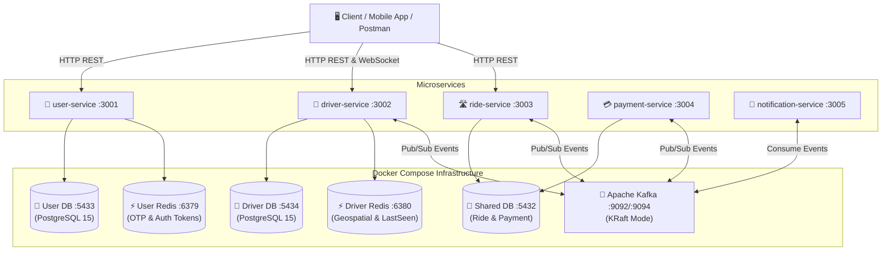

# FluxRide — Project Summary

## What is FluxRide?

FluxRide is an **event-driven microservices ride-sharing backend** (like Uber/Ola) built with **TypeScript, Express 5, PostgreSQL 15, Prisma 7, Redis 7, and Apache Kafka (KRaft mode)**. The entire infrastructure is orchestrated using **Docker Compose**.

Instead of a monolithic architecture, the system is decomposed into **independent microservices** that communicate via asynchronous Kafka events and REST / WebSocket APIs. Each service owns its dedicated database schema and can be developed, tested, and scaled independently.

---

## Architecture Overview


```mermaid
graph TB
    Client["🖥️ Client / Mobile App / Postman"]

    subgraph Docker["Docker Compose Infrastructure"]
        UDB[("🐘 User DB :5433<br/>(PostgreSQL 15)")]
        DDB[("🐘 Driver DB :5434<br/>(PostgreSQL 15)")]
        PDB[("🐘 Shared DB :5432<br/>(Ride & Payment)")]
        URDS[("⚡ User Redis :6379<br/>(OTP & Auth Tokens)")]
        DRDS[("⚡ Driver Redis :6380<br/>(Geospatial & LastSeen)")]
        KF["📨 Apache Kafka :9092/:9094<br/>(KRaft Mode)"]
    end

    subgraph Services["Microservices"]
        US["👤 user-service :3001"]
        DS["🚗 driver-service :3002"]
        RS["🛣️ ride-service :3003"]
        PS["💳 payment-service :3004"]
        NS["🔔 notification-service :3005"]
    end

    Client -->|HTTP REST| US
    Client -->|HTTP REST & WebSocket| DS
    Client -->|HTTP REST| RS

    US --> UDB
    US --> URDS

    DS --> DDB
    DS --> DRDS
    DS <-->|Pub/Sub Events| KF

    RS --> PDB
    RS <-->|Pub/Sub Events| KF

    PS --> PDB
    PS <-->|Pub/Sub Events| KF

    NS <-->|Consume Events| KF
```

---

## Tech Stack

| Layer | Technology |
|---|---|
| **Language** | TypeScript (strict mode) |
| **Runtime** | Node.js 22 (Alpine in Docker) with `tsx` (hot-reload dev server) |
| **Framework** | Express 5 |
| **ORM** | Prisma 7.8 with `@prisma/adapter-pg` (connection pooling) |
| **Databases** | PostgreSQL 15 (dedicated databases per domain: `user_db`, `driver_db`, `fluxride_db`) |
| **Cache & Geo** | Redis 7 (OTP storage, rate-limiting, driver geospatial location tracking) |
| **Message Broker** | Apache Kafka (Official `apache/kafka:latest` in KRaft mode, no Zookeeper required) |
| **WebSockets** | `ws` for real-time driver location streaming |
| **Auth** | JWT (Access + Refresh tokens), bcrypt for password/OTP hashing |
| **Orchestration** | Docker Compose |
| **Package Manager** | npm |

---

## Infrastructure (Docker Compose)

Defined in [`docker-compose.yaml`](./docker-compose.yaml):

| Container | Image | Host Port | Purpose |
|---|---|---|---|
| `fluxride-user-db` | `postgres:15-alpine` | `5433` | Dedicated database for `user-service` (`user_db`) |
| `fluxride-driver-db` | `postgres:15-alpine` | `5434` | Dedicated database for `driver-service` (`driver_db`) |
| `fluxride-postgres` | `postgres:15-alpine` | `5432` | Shared database for `ride-service` and `payment-service` |
| `fluxride-user-redis` | `redis:7-alpine` | `6379` | Dedicated Redis for `user-service` (OTP, registration tokens, auth data) |
| `fluxride-driver-redis` | `redis:7-alpine` | `6380` | Dedicated Redis for `driver-service` (geospatial live driver locations, lastSeen) |
| `fluxride-kafka` | `apache/kafka:latest` | `9092`, `9094` | KRaft-mode event broker (`9092` internal Docker, `9094` host access) |
| `fluxride-user-service` | `./user-service` | `3001` | Authentication and user profile service |
| `fluxride-driver-service` | `./driver-service` | `3002` | Driver onboarding, vehicle registration, location tracking |
| `fluxride-ride-service` | `./ride-service` | `3003` | Ride booking and lifecycle matching |

Persistent Docker volumes are configured for databases (`user_db_data`, `driver_db_data`, `postgres_data`, `user_redis_data`, `driver_redis_data`) so data persists across restarts.

---

## Microservices Breakdown

---

### 1. 👤 User Service (Port 3001) — ✅ ACTIVE

**Purpose**: Complete authentication & user profile management supporting passwordless OTP flows, email/phone verification, and JWT session handling.

**Key Features**:
- OTP request and verification (email & phone) via Redis with bcrypt hashing.
- User signup completion with verification token checks.
- Access tokens (15m expiry) and Refresh tokens (revocable, stored in DB).
- Password hashing with bcrypt.
- Profile retrieval and contact info management.

**Database Schema** ([`schema.prisma`](./user-service/prisma/schema.prisma)):
- `User`: `id`, `email`, `phone`, `firstName`, `lastName`, `role` (`RIDER`/`DRIVER`/`ADMIN`), `status`, `isEmailVerified`, `isPhoneVerified`, timestamps.
- `Otp`: `id`, `identifier`, `otpHash`, `purpose` (`LOGIN_OR_SIGNUP`/`ADD_PHONE`/`ADD_EMAIL`), `attempts`, `expiresAt`.
- `RegistrationToken`: `id`, `token`, `identifier`, `expiresAt`, `used`.
- `RefreshToken`: `id`, `token`, `userId`, `expiresAt`, `isRevoked`.

**API Endpoints**:
| Method | Route | Description | Auth Required |
|---|---|---|---|
| `GET` | `/health` | Service health check | No |
| `POST` | `/api/auth/otp/request` | Request login/signup OTP | No |
| `POST` | `/api/auth/otp/verify` | Verify OTP | No |
| `POST` | `/api/auth/complete-signup` | Complete rider/driver user registration | No |
| `POST` | `/api/auth/token/refresh` | Issue new access token using refresh token | No |
| `POST` | `/api/auth/logout` | Revoke active refresh token | Yes (Bearer JWT) |
| `POST` | `/api/auth/phone/add/request` | Request OTP to add phone number | Yes (Bearer JWT) |
| `POST` | `/api/auth/phone/add/verify` | Verify and link phone number | Yes (Bearer JWT) |

---

### 2. 🚗 Driver Service (Port 3002) — ✅ ACTIVE

**Purpose**: Driver registration, vehicle management, availability toggling, real-time WebSocket location streaming, and Kafka event publishing/consumption.

**Key Features**:
- Driver onboarding linked to `user-service` user ID.
- Vehicle registration (`CAR`, `BIKE`, `AUTO`).
- Online/Offline status management.
- Real-time location ingest via WebSocket (`ws://host:3002/location`).
- Geospatial queries in Redis (`/api/drivers/nearby`) to find available drivers nearby.
- Automatic Kafka topic creation (`driver.events`, `ride.events`) on service boot.
- Event consumption for ride events (`ride.events`) and event publishing for driver status.

**Database Schema** ([`schema.prisma`](./driver-service/prisma/schema.prisma)):
- `Driver`: `id`, `userId` (unique), `licenseNumber`, `status` (`OFFLINE`/`ONLINE`/`ON_RIDE`), `rating`, `lastSeenAt`, timestamps.
- `Vehicle`: `id`, `driverId`, `model`, `plateNumber`, `type` (`CAR`/`BIKE`/`AUTO`), timestamps.

**API Endpoints**:
| Method | Route | Description | Auth Required |
|---|---|---|---|
| `GET` | `/health` | Service health check | No |
| `GET` | `/api/drivers/nearby` | Find nearby online drivers within radius | No |
| `GET` | `/api/drivers/:id` | Get public driver profile by ID | No |
| `POST` | `/api/drivers/register` | Register authenticated user as a driver | Yes (Bearer JWT) |
| `POST` | `/api/drivers/vehicle` | Add/update vehicle details | Yes (Bearer JWT) |
| `PUT` | `/api/drivers/availability` | Toggle driver status (`ONLINE` / `OFFLINE`) | Yes (Bearer JWT) |
| `GET` | `/api/drivers/profile` | Get current driver's profile & vehicle | Yes (Bearer JWT) |
| `WS` | `/location` | WebSocket for streaming GPS coordinates | WebSocket Handshake |

---

### 3. 🛣️ Ride Service (Port 3003) — ✅ ACTIVE

**Purpose**: Manages ride requests, status transitions (`REQUESTED` → `ACCEPTED` → `IN_PROGRESS` → `COMPLETED` / `CANCELLED`), and emits ride lifecycle events over Kafka.

**API Endpoints**:
| Method | Route | Description |
|---|---|---|
| `POST` | `/api/rides/request` | Request a ride |
| `PATCH` | `/api/rides/:id/accept` | Driver accepts ride |
| `PATCH` | `/api/rides/:id/start` | Start ride journey |
| `PATCH` | `/api/rides/:id/complete` | Complete ride |
| `PATCH` | `/api/rides/:id/cancel` | Cancel ride |
| `GET` | `/api/rides/:id` | Fetch ride details |
| `GET` | `/api/rides/rider/:riderId` | List rider's ride history |
| `GET` | `/api/rides/driver/:driverId` | List driver's ride history |

---

### 4. 💳 Payment Service (Port 3004) — 🚧 SCAFFOLDED

**Purpose**: Fare calculation, wallet/card processing, transaction status tracking, and payment event emission.

---

### 5. 🔔 Notification Service (Port 3005) — 🚧 SCAFFOLDED

**Purpose**: Listens to Kafka topics (`ride.events`, `driver.events`) to send push notifications, emails, and SMS alerts to riders and drivers.

---

## Getting Started

### Prerequisites
- [Docker & Docker Desktop](https://www.docker.com/) (Compose v2+)
- [Node.js 22+](https://nodejs.org/) (for local development outside containers)

### 1. Clone & Environment Setup
Ensure each service has its `.env` configured (examples available in `.env.example` files).

### 2. Start Services via Docker Compose

To start the database and messaging infrastructure along with `user-service` and `driver-service`:
```bash
docker compose up -d --build user-service driver-service
```

This will automatically:
1. Start `user-db` (port 5433) and `driver-db` (port 5434).
2. Start `user-redis` (port 6379), `driver-redis` (port 6380), and `kafka` (ports 9092, 9094).
3. Apply pending Prisma migrations automatically on startup (`prisma migrate deploy`).
4. Initialize required Kafka topics (`driver.events`, `ride.events`).
5. Launch `user-service` on `http://localhost:3001` and `driver-service` on `http://localhost:3002`.

### 3. Check Running Containers
```bash
docker compose ps
```

### 4. Run Prisma Migrations Manually (Optional)
If modifying schemas during local development:
```bash
# In user-service:
cd user-service
npm run db:migrate

# In driver-service:
cd driver-service
npm run db:migrate
```

---

## Kafka Event Schema

### `ride.events`
Published when ride status updates occur:
```json
{
  "eventType": "RIDE_REQUESTED" | "RIDE_ACCEPTED" | "RIDE_COMPLETED",
  "timestamp": "2026-09-16T08:50:00.000Z",
  "payload": {
    "rideId": "uuid",
    "riderId": "uuid",
    "driverId": "uuid",
    "pickup": { "lat": 12.9716, "lng": 77.5946 },
    "drop": { "lat": 12.9352, "lng": 77.6245 }
  }
}
```

### `driver.events`
Published when driver availability or location updates occur:
```json
{
  "eventType": "DRIVER_ONLINE" | "DRIVER_OFFLINE" | "LOCATION_UPDATED",
  "timestamp": "2026-09-16T08:50:00.000Z",
  "payload": {
    "driverId": "uuid",
    "status": "ONLINE",
    "lat": 12.9716,
    "lng": 77.5946
  }
}
```
